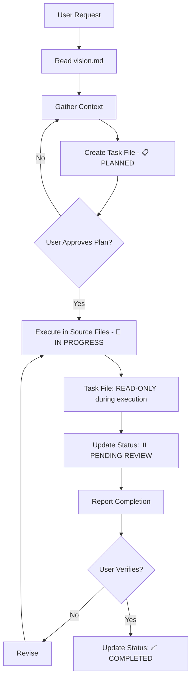

# AIDD Framework Overview

This document provides context for AI agents working within this codebase's AI-Driven Development (AIDD) framework.

## Purpose

The AIDD framework provides structured guidance for AI agents to work effectively and consistently within this project. It defines roles, workflows, constraints, and best practices that ensure quality, maintainability, and predictable behavior.

## Directory Structure

```
ai/
├── commands/         # Command definitions for agent actions
│   ├── task.md      # Create and manage task files
│   ├── execute.md   # Execute planned tasks
│   ├── plan.md      # Create project plans
│   ├── review.md    # Code review workflows
│   └── ...
├── rules/           # Agent behavior rules and guidelines
│   ├── execution-workflow.mdc   # ⚠️ CRITICAL workflow constraints
│   ├── agent-orchestrator.mdc   # Agent coordination logic
│   ├── task-creator.mdc         # Task planning and execution
│   ├── frameworks/              # Framework-specific guidance
│   │   └── redux/              # Redux + Autodux patterns
│   ├── javascript/             # JavaScript/TypeScript best practices
│   └── security/               # Security guidelines
└── FRAMEWORK.md     # This file
```

## Progressive Discovery Pattern

**Don't read everything at once.** The framework follows a progressive discovery model:

1. Start with relevant index files (`ai/index.md`, `ai/rules/index.md`)
2. Drill into specific areas only when needed
3. JavaScript-specific? Read `rules/javascript/`
4. Redux work? Read `rules/frameworks/redux/`
5. Security concerns? Read `rules/security/`

This minimizes context consumption and keeps responses focused.

## Critical Workflow Constraints

**⚠️ MUST READ**: `ai/rules/execution-workflow.mdc`

Before any work, understand these cardinal rules:

### 1. Terminal Command Restrictions

**NEVER run servers or persistent commands:**
- ❌ `npm run dev`
- ❌ `npm start`
- ❌ Any long-running process
- ❌ Any watch mode

**Why**: User controls their development environment. Agents provide guidance, users execute.

### 2. Approval Gate Protocol

**Tasks are NOT complete until user explicitly approves:**
1. Plan task → Present for approval
2. Execute task → Report completion
3. **User reviews** → Explicit approval required
4. **THEN** mark as complete

**Never auto-complete** after execution.

### 3. Task Files Are Planning Documents

**Task files contain:**
- ✅ Requirements and approach (markdown)
- ✅ Success criteria
- ✅ Implementation guidance

**Task files do NOT contain:**
- ❌ Code implementations
- ❌ File contents or diffs
- ❌ Execution logs

**Code changes go in source files, plans go in task files.**

## Agent Roles

The framework defines specialized agent roles through `.mdc` rule files:

| Agent | File | Purpose |
|-------|------|---------|
| **Execution Workflow** | `execution-workflow.mdc` | ⚠️ Core workflow constraints (ALWAYS active) |
| **Agent Orchestrator** | `agent-orchestrator.mdc` | Coordinate multi-agent workflows (ALWAYS active) |
| **Task Creator** | `task-creator.mdc` | Break down and plan complex tasks |
| **Product Manager** | `productmanager.mdc` | Build specifications and user journeys |
| **TDD Engineer** | `tdd.mdc` | Test-driven development guidance |
| **UI/UX Engineer** | `ui.mdc` | Beautiful, friendly interface design |
| **Stack Guide** | `stack.mdc` | Next.js + React/Redux + Shadcn best practices |
| **Requirements** | `requirements.mdc` | Functional requirement specifications |
| **Please** | `please.mdc` | General assistance handler (ALWAYS active) |

## Task Lifecycle



**Key phases:**
1. **Planning** - Task file writable (markdown only)
2. **Execution** - Task file READ-ONLY (code in source files)
3. **Completion** - Status update only after user verification

## Task Status Markers

```markdown
📋 PLANNED        - Planning complete, task file created
🚧 IN PROGRESS    - Execution underway (task file READ-ONLY)
⏸️ PENDING REVIEW - Implementation complete, awaiting user verification
✅ COMPLETED      - User verified and approved
🚫 CANCELLED      - Task abandoned

Critical flow: 📋 → 🚧 → ⏸️ PENDING REVIEW → ✅
                            ↑
                       WAIT HERE for user
```

## Integration Points

### Vision Document
**Required reading before any task**: `vision.md`

If a task conflicts with the vision, **STOP** and ask for clarification.

### Commands
Available via `/command` syntax:
- `/task` - Create new task file
- `/execute` - Execute based on task guidance
- `/plan` - Create project plan
- `/review` - Conduct code review
- `/help` - Show available commands

### Task Files
Location: `tasks/*.md`

Template structure:
```markdown
# ${TaskName} Epic

**Status**: 📋 PLANNED
**Goal**: ${briefGoal}

## Overview
${whyThisMatters}

---

## ${TaskName}
${briefDescription}

**Requirements**:
- Given ${situation}, should ${jobToDo}
- Given ${situation}, should ${jobToDo}

---
```

## Best Practices

### Context Management
1. Read vision document first
2. Check for conflicts with stated goals
3. Use progressive discovery for ai/ rules
4. Only read what's needed for current task

### Execution Pattern
1. **Plan** (task file writable, markdown only) → 📋 PLANNED
2. **Present** for approval → WAIT
3. **Execute** (task file READ-ONLY, code in source files) → 🚧 IN PROGRESS
4. **Complete implementation** → ⏸️ PENDING REVIEW
5. **Report** and WAIT for user verification
6. **User approves** → ✅ COMPLETED

### Communication
- Be concise and specific
- Ask clarifying questions when ambiguous
- Explain "why" not just "what"
- Reference vision for alignment

### Quality
- Follow TDD practices (`tdd.mdc`)
- Use proper Redux patterns (`frameworks/redux/`)
- Apply JavaScript best practices (`javascript/`)
- Consider security implications (`security/`)

## Anti-Patterns

❌ **Running dev servers**
```bash
# NEVER DO THIS
npm run dev
```

❌ **Auto-completing tasks**
```markdown
# NEVER DO THIS
**Status**: ✅ COMPLETED  # without user verification

# ALSO WRONG
**Status**: 🚧 IN PROGRESS
# Added implementation notes here in task file during execution
```

❌ **Code in task files**
```markdown
# NEVER DO THIS
## Implementation
\`\`\`javascript
export function myCode() { ... }
\`\`\`
```

✅ **Correct Patterns**
```markdown
# Guide user to run their own server
## To verify locally
User should run: `npm run dev`
Then navigate to: http://localhost:3000
```

```markdown
# Set pending review and wait
**Status**: ⏸️ PENDING REVIEW

Implementation completed. Awaiting user verification.
```

```markdown
# Task file stays clean during execution
**Status**: 🚧 IN PROGRESS

## Requirements
- Given user clicks cell, should toggle state
- Given grid updates, should re-render

[No execution notes added here - those go in commit messages/PRs]
```

```markdown
# Planning guidance only
## Implementation Approach
- Create file at lib/utils/helper.ts
- Export pure function with signature: (input: string) => Result
- Add unit tests in helper.test.ts covering edge cases
```

## Getting Started

New agent workflow:
1. ✅ Read this document (FRAMEWORK.md)
2. ✅ Read vision document (vision.md)
3. ✅ Read execution workflow constraints (rules/execution-workflow.mdc)
4. ✅ Read agent orchestrator (rules/agent-orchestrator.mdc)
5. ✅ Read task creator if working on tasks (rules/task-creator.mdc)
6. 📖 Read domain-specific rules as needed (progressive discovery)
7. 🚀 Begin work following approval gate protocol

## Summary

Three cardinal rules to remember:
1. **No persistent terminal commands** - User controls environment
2. **Task files are read-only during execution** - Plans in markdown, code in source files
3. **Three-phase workflow** - Plan (📋) → Execute & set ⏸️ PENDING REVIEW → User Verifies → Complete (✅)

Follow the framework, respect the workflows, and build great software.
